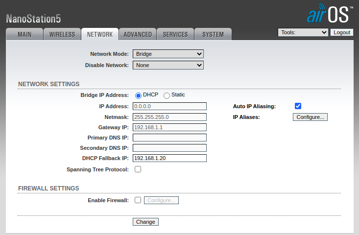

# Ubiquiti NanoStation 5
The [included datasheet](./ns5_datasheet.pdf) is originally from: [dl.ubnt.com/ns5_datasheet.pdf](https://dl.ubnt.com/ns5_datasheet.pdf)

DHCP Fallback IP: [`192.168.1.20`](http://192.168.1.20)  
Username: `ubnt`  
Password: `ubnt`  

## Station
  
  
  
  

## AP / Client
  
  
  
  
